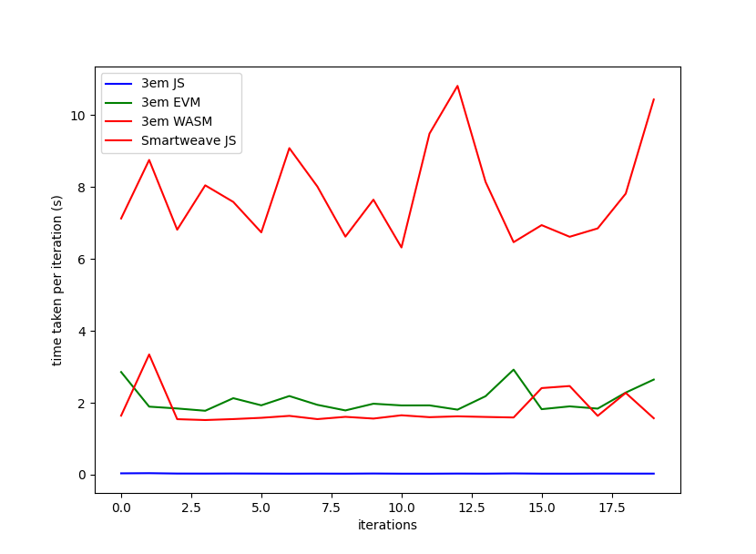
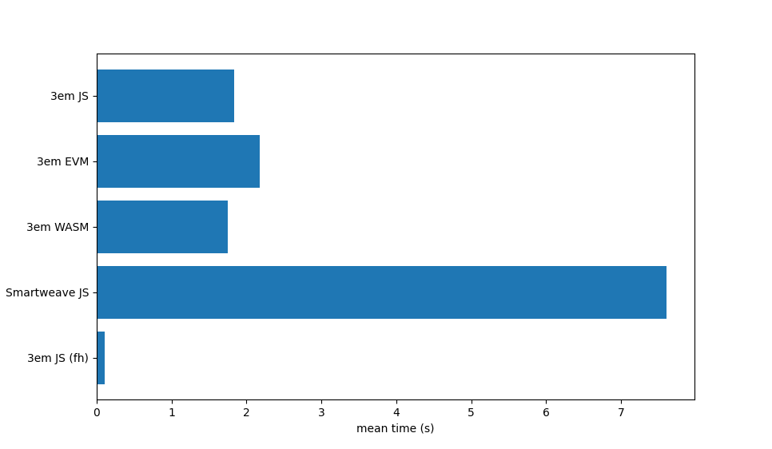

<p align="center">

<h3 align="center">3em</h3>

<p align="center">
    A blazingly fast, secure, reliable, multi-language execution environment for smart contracts inside the <a href="https://arweave.org">Arweave</a> ecosystem.
  </p>
</p>

<p align="center">
Special thanks to:
<ul>
    <li>
        <a href="https://verto.exchange">Verto Exchange</a> for incubating this project as well as all their members which have been key part of conceiving 3em.
    </li>
</ul>
</p>

## Purpose

3em was conceived as an alternate solution to
[SmartWeave](https://github.com/ArweaveTeam/SmartWeave) while still
accomplishing the same goal: Simple & Scalable smart contracts on the Arweave
protocol.

After receiving multiple feedback from different individuals and teams, we
realize there were 3 main issues that needed to be solved:

- Speed
- Security
- Multi-language support

For more information on how we solved the issues mentioned above, please refer
to our
[technical guide](https://github.com/three-em/3em/tree/main/docs/technical_guide.md).

## Install

**With Shell:**

```sh
curl -fsSL https://3em.dev/install.sh | sh
```

**With PowerShell:**

```powershell
iwr https://3em.dev/install.ps1 -useb | iex
```

## Benchmarks

> Note about `redstone-smartweave` benchmarks.
>
> The benchmarks shown earlier were wrong and we decided to remove them.
> `redstone-smartweave` might soon switch to their own gateways making
> comparsion irrelevant.
>
> You can find a fair overview of 3em & `redstone-smartweave` 0.4.12
> [here](https://github.com/littledivy/3em_redstone_benchmarks)

## CLI benchmarks

Measures:

- Startup time
- Filesystem cache
- Execution performance
- Interaction loading

```bash
$ hyperfine 'target/release/bench' 'target/release/bench_evm' 'target/release/bench_wasm' 'node tools/benchmarks/smartweave/index.js' 'target/release/bench_fh' -r 20 --export-json bench.json
```





```
Summary
  'target/release/bench_fh' ran
   15.57 ± 6.84 times faster than 'target/release/bench_wasm'
   16.37 ± 7.72 times faster than 'target/release/bench'
   19.47 ± 9.36 times faster than 'target/release/bench_evm'
   67.79 ± 29.33 times faster than 'node tools/benchmarks/smartweave/index.js'
```

- The JavaScript contract used in `3em JS` and `SmartWeave JS` is
  `t9T7DIOGxx4VWXoCEeYYarFYeERTpWIC1V3y-BPZgKE`.
- The WebAssembly contract source used in `3em WASM` can be found
  [here](testdata/01_wasm/01_wasm.rs). The block height is **not** fixed.
- The EVM contract source used in `3em EVM` can be found
  [here](testdata/evm/state1.sol). The block height is **not** fixed.
- There are functional differences between evm and wasm contracts and the number
  of interactions (except the JavaScript contract).
- `fh` = Fixed height of `749180`
- The gateway used is `arweave.net`
- Host information can be found
  [here](https://github.com/littledivy/3em_redstone_benchmarks/blob/main/system_info.txt)

## Multi-language support

3em supports contracts written in:

- JavaScript
- WebAssembly (Rust, AssemblyScript, etc.)
- EVM bytecode (Solidity, Yul, etc)

Please refer to the
["helpers"](https://github.com/three-em/3em/tree/main/helpers) for details on
writing contracts.

## Smartweave Compatability

3em follows the SmartWeave
[contract design](https://github.com/ArweaveTeam/SmartWeave/blob/master/CONTRACT-GUIDE.md).
This essentially means two things:

- Contracts need to be deployed to Arweave in order for 3EM to run them
- 3em is capable of running existing Smartweave contracts and exposes backward
  compatible APIs (like the `SmartWeave` global)

## Determinism

3em execution is deterministic. Random operations have a constant seed and Non
deterministic APIs are overriden with their deterministic version. You can read
more about it in our technical guide.

## CLI

### Available Commands

- `three_em run`
  - Runs a contract deployed to Arweave given certain options.
- `three_em dry-run`
  - Runs a local contract which has not yet been deployed to Arweave.
  - Only JS and WASM contracts are accepted during `dry-run`.

---

### run

The following flags are available for `three_em run`:

- `--arweave-host` | `string`
  - URL of gateway to be used during execution
  - Default: arweave.net
- `--arweave-port` | `number`
  - Port of gateway to be used during execution
  - Default: 443
- `--arweave-protocol` | `string`
  - Network protocol to be used during execution
  - Default: https
- `--contract-id` | `string`
  - ID of contract to be evaluated
- `--pretty-print` | `boolean`
  - Whether output should be printed in a prettified JSON form
  - Default: false
- `--no-print` | `boolean`
  - Whether output should be printed in the console. True will not print any
    output
  - Default: false
- `--show-validity` | `boolean`
  - Whether output should contain the validity table of evaluated interactions
- `--save` | `string`
  - If provided, it contains a file path where output will be saved in JSON form
- `--benchmark` | `boolean`
  - Whether to benchmark the execution time of the contract
  - Default: false
- `--height` | `number`
  - Maximum height to be used during evaluation
- `--no-cache`
  - Whether it should use 3em's built-in cache system
- `--show-errors`
  - Whether errors from failed interactions should be printed

**Example**

```shell
three_em run --contract-id t9T7DIOGxx4VWXoCEeYYarFYeERTpWIC1V3y-BPZgKE
```

---

### dry-run

The following flags are available for `three_em dry-run`:

- `--file`
  - File path for dry run JSON input.
  - Please refer to our dry run documentation
    [here](https://github.com/three-em/3em/tree/main/docs/dry_run.md)
- `--arweave-host` | `string`
  - URL of gateway to be used during execution
  - Default: arweave.net
- `--arweave-port` | `number`
  - Port of gateway to be used during execution
  - Default: 443
- `--arweave-protocol` | `string`
  - Network protocol to be used during execution
  - Default: https
- `--pretty-print` | `boolean`
  - Whether output should be printed in a prettified JSON form
  - Default: false
- `--show-validity` | `boolean`
  - Whether output should contain the validity table of evaluated interactions

`dry-run` requires a JSON file containing the _dry-run_ structure, for more
information about it please refer to
[our dry run guide](https://github.com/three-em/3em/tree/main/docs/dry_run.md).
